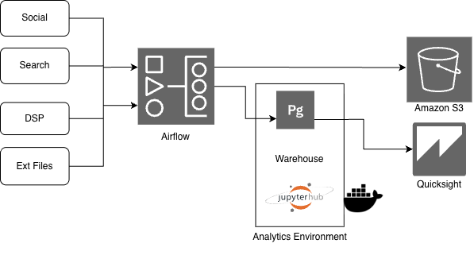

An entertainment agency faced fragmented and chaotic data across Social, Search, DSPs, and other third-party platforms.

{:.ioda}

**Challenge:**
- Each platform (Meta, Google Ads, DV360, etc.) had its own schema, access method, and update schedule.
- ETL processes were hard to scale, and difficult to monitor.
- Business units waited days for performance insights due to disconnected tools and manual workflows.
- Data scientists lacked a centralized workspace to share ad-hoc analyses and notebooks.
- Ungoverned pipelines made audits and client reporting error-prone.

**Approach:**
- Built a modern end-to-end data pipeline using Airflow and AWS-native tools, containerized with Docker for scalability.
- Created a custom JupyterHub-based Data Science environment, enabling analysts to run, share, and collaborate on models and queries using unified warehouse data.

**Outcome:**
- Faster, data-driven campaign optimization.
- Analysts freed from manual data tasks, focusing on actionable insights.
- Real-time visibility for marketing leaders.
- Improved governance, audit readiness, and compliance.

---
Think my experience aligns with your needs? or got any questions that I can help with? <a href='/contact'>Let’s connect.</a> 