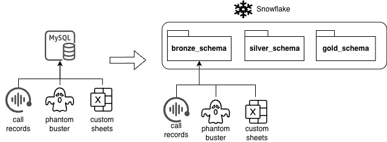

A US-based lead generation agency was operating on an on-premise MS SQL Server originally built for transactional workloads, which had increasingly been used for reporting and analytics.

{:.ioda}

**Challenge:**
- Limited scalability and high fixed infrastructure costs
- Complex legacy schemas with undocumented SQL logic
- Slow turnaround for new analytics and reporting needs

**Approach:**
- Assessed existing SQL schemas, workloads, and critical reports
- Designed a Snowflake-based data warehouse optimised for analytics
- Migrated historical and incremental data from SQL Server to Snowflake
- Refactored SQL logic into Snowflake-native transformations
- Enabled role-based access and BI tool integration
- Ran systems in parallel to validate data accuracy before cutover

**Outcome:**
- Elastic, on-demand compute for reporting and ad-hoc analysis
- Reduced infrastructure and licensing costs through a pay-per-use model
- Faster and more reliable analytics delivery
- Scalable foundation for advanced analytics and data science

---
Think my experience aligns with your needs? or got any questions that I can help with? <a href='/contact'>Let’s connect.</a> 