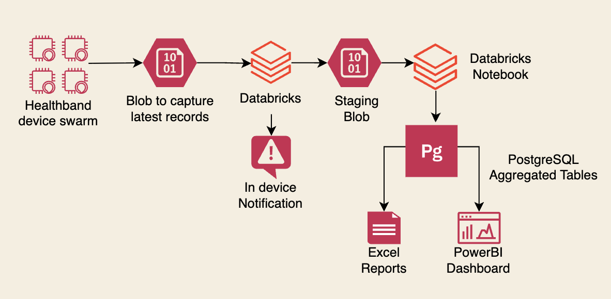

A wearable healthcare company was generating massive high-frequency data in Azure Blob Storage, tracking metrics like heart rate, respiration, oxygen levels, and activity every minute.

{:.ioda}

**Scope**:
- Instantly alert users when heart rate crossed thresholds.
- Send personalized notifications and celebrate user milestones.
- Warn users of dangerously low oxygen levels.

**Approach**:
- Leveraged scheduled Databricks notebooks to process terabytes of incoming data and deliver near real-time alerts.
- Performed aggregated analytics (daily/weekly) and stored results in PostgreSQL for rapid access to frequently used metrics.

**Outcome**:
- 95% of abnormal readings detected and alerted in real-time.
- Reduced churn by 25%.
- Query times for common metrics cut by 90%.
- Scalable solution capable of handling terabytes of high-frequency data.

---
Think my experience aligns with your needs? or got any questions that I can help with? <a href='/contact'>Let’s connect.</a> 